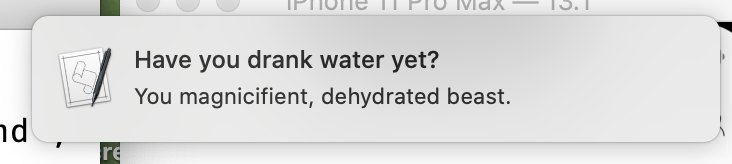

# Drink Water Bot

   

A bot for mac that gives you every 30 minutes a notification to drink water. Put it in your autostart to have it run every time you start your computer!

In order to get a "dismiss" button on the notification go into Settings -> Notfications -> Script Editor and set it to "Alerts".
